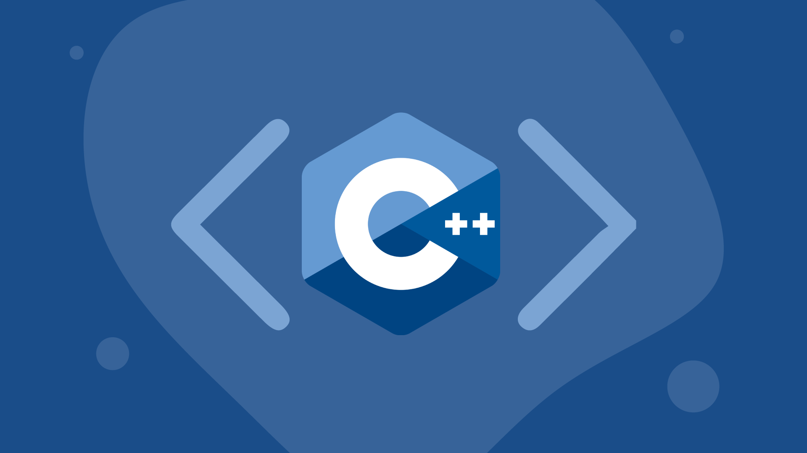

# C++ Fundamentals for Robotics



## 1. Introduction to C++

C++ is a general-purpose programming language that was developed by Bjarne Stroustrup in the early 1980s. It's an extension of the C language, adding features like object-oriented programming, templates, and exception handling. C++ is known for its performance and flexibility, making it a popular choice for system programming, game development, and applications where efficiency is key.

### 1.1 Key Features of C++

- **Object-Oriented Programming**: C++ supports classes and objects, allowing you to create complex data structures and encapsulate data and behavior.
- **Templates**: With templates, you can create generic functions and classes, enabling code reusability and type safety.
- **Exception Handling**: C++ allows you to handle errors and exceptional situations in a structured way.
- **Standard Template Library (STL)**: This library provides a collection of commonly used data structures and algorithms.

---

## 2. Basic Syntax and Structure

C++ has a syntax that's similar to C, with some additional features. Here's a quick overview of the basic structure of a C++ program:

```cpp
#include <iostream> // Include a standard library for input/output operations

int main() { // Main function, entry point of the program
    std::cout << "Hello, World!" << std::endl; // Output text to the console
    return 0; // Return a status code to the operating system
}
```

In this example, the `#include` directive is used to include a header file, `int main()` defines the entry point of the program, and `std::cout` is used to output text to the console.

### 2.1 Comments

C++ supports two types of comments:

- **Single-line comments**: Start with `//` and continue to the end of the line.
- **Multi-line comments**: Start with `/*` and end with `*/`.

---

## 3. Data Types, Variables, and Constants

C++ has various data types for different kinds of values. Here's a brief overview:

- **Integers**: Whole numbers. Common types include `int`, `short`, `long`, and `long long`.
- **Floating-point numbers**: Numbers with fractional parts. Common types are `float` and `double`.
- **Characters**: Single characters, using `char`.
- **Booleans**: True or false values, using `bool`.

### 3.1 Variables

Variables in C++ are used to store data. You need to declare a variable before using it, specifying its type and name:

```cpp
int age = 25; // Declares an integer variable named 'age' with a value of 25
```

### 3.2 Constants

Constants are variables whose values cannot be changed after initialization. You can use the `const` keyword or `#define` to define constants:

```cpp
const int MAX_SIZE = 100; // Constant integer with a value of 100
#define PI 3.14159 // Preprocessor constant
```

---

## 4. Control Structures

Control structures are used to control the flow of a program. Here are some common ones:

### 4.1 Conditionals

C++ supports `if`, `else if`, and `else` statements to execute different code blocks based on conditions:

```cpp
int number = 10;

if (number > 10) {
    std::cout << "Greater than 10" << std::endl;
} else if (number == 10) {
    std::cout << "Equal to 10" << std::endl;
} else {
    std::cout << "Less than 10" << std::endl;
}
```

### 4.2 Loops

Loops allow you to repeat code blocks. C++ has three common loop structures:

- **For Loop**: Ideal for counting or iterating over a range:

```cpp
for (int i = 0; i < 5; i++) {
    std::cout << i << std::endl;
}
```

- **While Loop**: Repeats as long as a condition is true:

```cpp
int count = 0;
while (count < 5) {
    std::cout << count << std::endl;
    count++;
}
```

- **Do-While Loop**: Similar to `while`, but always runs at least once:

```cpp
int count = 0;
do {
    std::cout << count << std::endl;
    count++;
} while (count < 5);
```

---

That's a summary of the key topics for this week. Remember to practice writing simple C++ programs, focusing on understanding basic syntax, data types, variables, constants, and control structures. Happy coding!
