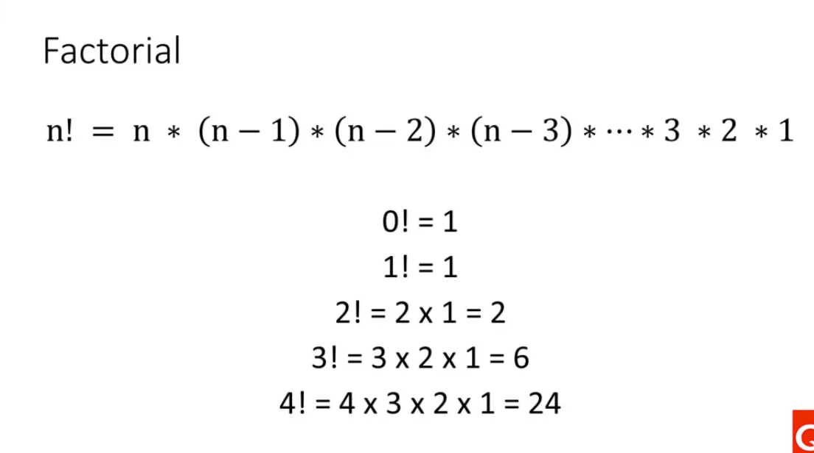
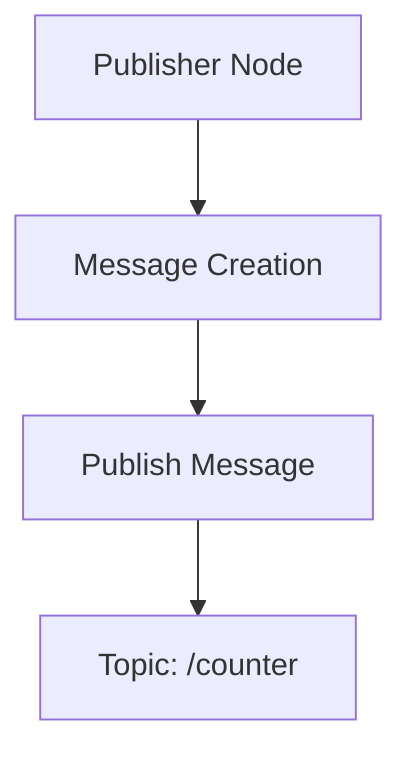
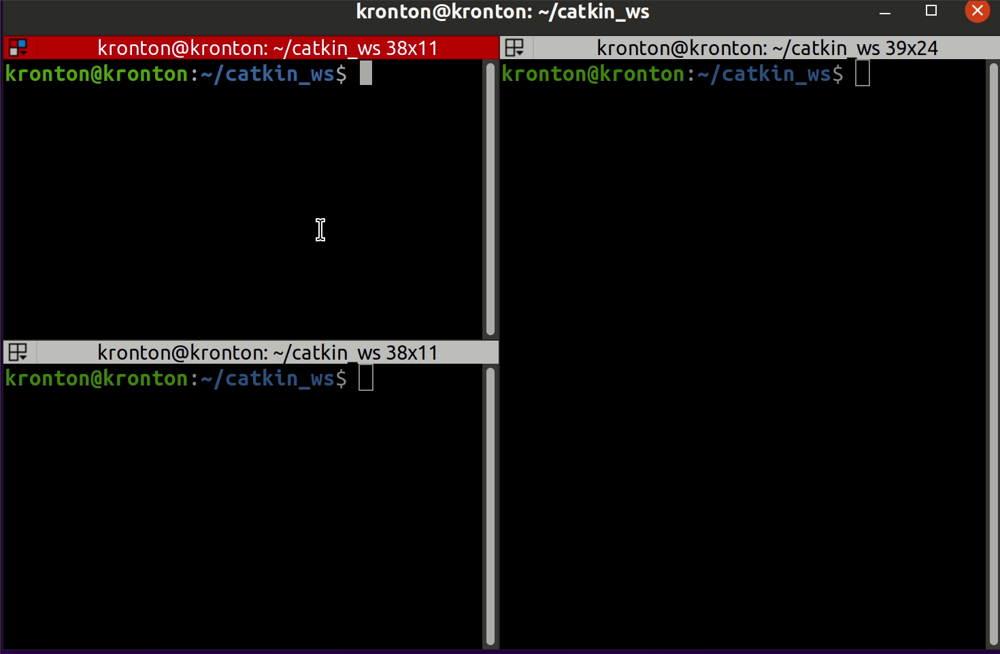
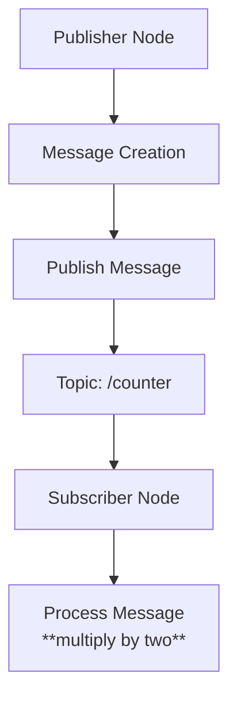
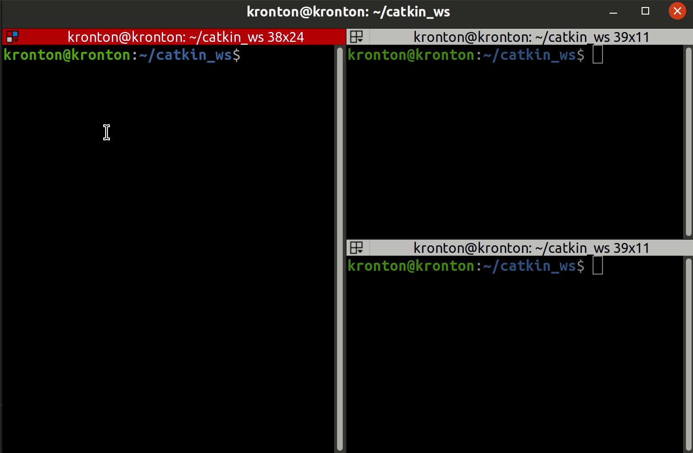

# C++ Functions and ROS Nodes 
 
## Table Of Content
- [C++ Functions and ROS Nodes](#c-functions-and-ros-nodes)
  - [Table Of Content](#table-of-content)
  - [0. Build System Using CMake](#0-build-system-using-cmake)
    - [0.1 What is CMake?](#01-what-is-cmake)
    - [0.2 Setting Up CMake](#02-setting-up-cmake)
    - [0.3 CMakeLists.txt File](#03-cmakeliststxt-file)
    - [0.4 Build and Run](#04-build-and-run)
    - [0.5 Adding New Executable Files](#05-adding-new-executable-files)
    - [Summary:](#summary)
  - [1. Functions](#1-functions)
    - [1.1 Defining a Function](#11-defining-a-function)
    - [1.2 Example: Simple Addition Function](#12-example-simple-addition-function)
    - [1.3 Function Parameters and Arguments](#13-function-parameters-and-arguments)
    - [Example Pass by Value ](#example-pass-by-value-)
    - [Example Pass by Reference ](#example-pass-by-reference-)
    - [1.4 Returning Values from Functions](#14-returning-values-from-functions)
    - [1.5 Function Overloading](#15-function-overloading)
    - [Example: Function Overloading to Calculate Area](#example-function-overloading-to-calculate-area)
    - [1.6 Example: Function to Calculate Factorial](#16-example-function-to-calculate-factorial)
      - [1.6.1 Function Definition:](#161-function-definition)
      - [5.6.2 Main Function:](#562-main-function)
      - [1.6.3 Recursion Flow:](#163-recursion-flow)
      - [1.6.4 Final Output:](#164-final-output)
      - [Summary:](#summary-1)
  - [2. ROS 1 C++ Publisher Node – Counter Example](#2-ros-1-c-publisher-node--counter-example)
    - [2.1 What is a ROS Publisher?](#21-what-is-a-ros-publisher)
      - [ROS Node Architecture](#ros-node-architecture)
    - [2.2 Node Overview](#22-node-overview)
    - [2.3 Publisher Node Code](#23-publisher-node-code)
    - [2.4 Code Explanation](#24-code-explanation)
    - [2.5 Running the Node](#25-running-the-node)
      - [Step 1: Add the Node to Your ROS Package](#step-1-add-the-node-to-your-ros-package)
      - [Step 2: Build the Package](#step-2-build-the-package)
      - [Step 3: Run the Node](#step-3-run-the-node)
      - [Step 4: View the Messages](#step-4-view-the-messages)
    - [2.6 Summary](#26-summary)
  - [3. ROS 1 C++ Subscriber Node – Multiply by Two](#3-ros-1-c-subscriber-node--multiply-by-two)
    - [3.1 What is a ROS Subscriber?](#31-what-is-a-ros-subscriber)
      - [ROS Node Architecture](#ros-node-architecture-1)
    - [3.2 Subscriber Node Code](#32-subscriber-node-code)
    - [3.3 Code Explanation](#33-code-explanation)
    - [3.4 Build System Using CMake](#34-build-system-using-cmake)
    - [3.5 Build and Run the Subscriber Node](#35-build-and-run-the-subscriber-node)
    - [3.6 Summary](#36-summary)
---

## 0. Build System Using CMake

In this section, we'll go through how to set up and use **CMake** to build your C++ project, which includes compiling and linking all the source files containing your function examples.

### 0.1 What is CMake?

CMake is a cross-platform build system generator. It helps automate the build process for projects, making it easier to compile, link, and manage dependencies across different operating systems and development environments.

### 0.2 Setting Up CMake

To build the project using CMake, you need to create a `CMakeLists.txt` file, which contains the instructions for building the project.

### 0.3 CMakeLists.txt File

Here's a simple `CMakeLists.txt` file that you can use to build the C++ examples mentioned in this project:


```cmake
#define the version of CMake you are using here 3.1
cmake_minimum_required(VERSION 3.1)
#project name
project(first_project)

#C++ version in use, here 17

set(CMAKE_CXX_STANDARD 17)

#add executable main, this creates main.o
add_executable(hello_ros src/ex0.cpp)
```


### 0.4 Build and Run

1. **Create a build directory**:
   CMake recommends building the project in a separate directory (e.g., `build`).
   ```bash
   mkdir build
   cd build
   ```

2. **Generate the build files**:
   Inside the `build` directory, run CMake to generate the build configuration:
   ```bash
   cmake ..
   ```

3. **Build the project**:
   After generating the build files, compile the project using `make`:
   ```bash
   make
   ```

4. **Run the executable**:
   Once the project is built, you can run the executable:
   ```bash
   ./main
   ```

### 0.5 Adding New Executable Files

To add new C++ Executable files, simply update the `CMakeLists.txt` file by appending them to the `add_executable()` , like so:

```cmake
#add executable main, this creates main.o
add_executable(hello_ros src/ex0.cpp)

```

### Summary:
- CMake simplifies the process of building C++ projects, especially when managing multiple source files.
- The `CMakeLists.txt` file defines how the project is compiled and linked, and can be easily extended as the project grows.


## 1. Functions

Functions are a way to encapsulate and reuse code. They allow you to break down complex problems into smaller, manageable pieces, which makes your code more organized and easier to understand.

### 1.1 Defining a Function

A function in C++ consists of a return type, a name, a parameter list, and a body. Here's the basic syntax:

```cpp
return_type function_name(parameter_list) {
    // Function body
    return value; // Optional: Only needed if return_type is not void
}
```

### 1.2 Example: [Simple Addition Function](source-code/examples/src/ex1.cpp)

Let's look at a simple example where we define a function that adds two numbers and returns the result:

```cpp
#include <iostream> 

int add(int a, int b) {
    return a + b;
}

int main() {
    int result = add(3, 5); // Calling the add function
    std::cout << "The sum is: " << result << std::endl; // Output: The sum is: 8
    return 0;
}

```

### 1.3 Function Parameters and Arguments

Functions can take parameters (also known as arguments) that allow you to pass data into the function. These parameters act as placeholders for the actual values you provide when calling the function.

- **Pass by Value**: The value of the argument is copied into the function parameter. Changes to the parameter do not affect the original argument.
### [Example Pass by Value ](source-code/examples/src/ex2.cpp)
  ```cpp
  #include <iostream> 

  void increment(int value) {
      value++;
  }

  int main() {

      int num = 10;
      int total = increment(num);
      std::cout << "num value: " << num << std::endl;
      std::cout << "total value: " << total << std::endl; 
      return 0;
  }
  ```


- **Pass by Reference**: You can pass arguments by reference using the `&` symbol. This allows the function to modify the original argument.
  
### [Example Pass by Reference ](source-code/examples/src/ex3.cpp)
  ```cpp
  #include <iostream> 

  void increment(int &value) {
      value++;
  }

  int main() {

      int num = 10;
      int total = increment(num);
      std::cout << "num value: " << num << std::endl;
      std::cout << "total value: " << total << std::endl; 
      return 0;
  }
  ```

### 1.4 Returning Values from Functions

Functions can return a value to the caller using the `return` statement. The type of the returned value must match the function's return type.

### 1.5 Function Overloading

C++ allows you to define multiple functions with the same name, as long as they have different parameter lists. This is known as function overloading.

```cpp
int multiply(int a, int b) {
    return a * b;
}

double multiply(double a, double b) {
    return a * b;
}

int main() {
    int result1 = multiply(3, 5); // Calls the int version
    double result2 = multiply(3.5, 5.5); // Calls the double version
    std::cout << "Int multiplication: " << result1 << std::endl; // Output: 15
    std::cout << "Double multiplication: " << result2 << std::endl; // Output: 19.25
    return 0;
}
```
### [Example: Function Overloading to Calculate Area](source-code/examples/src/ex6.cpp)

### 1.6 Example: Function to Calculate Factorial


Let's create a function that calculates the factorial of a number using recursion:

```cpp
int factorial(int n) {
    if (n <= 1) {
        return 1;
    } else {
        return n * factorial(n - 1);
    }
}

int main() {
    int number = 5;
    std::cout << "Factorial of " << number << " is: " << factorial(number) << std::endl; // Output: 120
    return 0;
}
```
Let's break The code down step by step:

#### 1.6.1 Function Definition:

```cpp
int factorial(int n) {
    if (n <= 1) {
        return 1;
    } else {
        return n * factorial(n - 1);
    }
}
```

- **Function Name:** `factorial`
- **Parameter:** `int n` - The function takes a single integer parameter `n`, which is the number for which we want to calculate the factorial.

- **Base Case:**
  ```cpp
  if (n <= 1) {
      return 1;
  }
  ```
  - The base case of the recursion is when `n` is less than or equal to `1`. In this case, the function returns `1`.
  - This is because the factorial of `0` or `1` is `1` by definition.

- **Recursive Case:**
  ```cpp
  return n * factorial(n - 1);
  ```
  - If `n` is greater than `1`, the function calls itself with `n-1` and multiplies the result by `n`.
  - This recursive call continues until it reaches the base case.

#### 5.6.2 Main Function:

```cpp
int main() {
    int number = 5;
    std::cout << "Factorial of " << number << " is: " << factorial(number) << std::endl;
    return 0;
}
```

- **Variable Declaration:**
  ```cpp
  int number = 5;
  ```
  - An integer variable `number` is declared and initialized with the value `5`. This is the number for which the factorial will be calculated.

- **Function Call and Output:**
  ```cpp
  std::cout << "Factorial of " << number << " is: " << factorial(number) << std::endl;
  ```
  - The `factorial` function is called with `number` as the argument.
  - The result of the function call is printed to the console using `std::cout`.
  - The expected output will be `Factorial of 5 is: 120`.

#### 1.6.3 Recursion Flow:
Let's go through the recursion flow when `number = 5`:

- **First Call:** `factorial(5)`  
  Since `5 > 1`, it returns `5 * factorial(4)`.
  
- **Second Call:** `factorial(4)`  
  Since `4 > 1`, it returns `4 * factorial(3)`.

- **Third Call:** `factorial(3)`  
  Since `3 > 1`, it returns `3 * factorial(2)`.

- **Fourth Call:** `factorial(2)`  
  Since `2 > 1`, it returns `2 * factorial(1)`.

- **Fifth Call:** `factorial(1)`  
  Since `1 <= 1`, it returns `1`.

- **Backtracking:**
  - `factorial(2)` returns `2 * 1 = 2`.
  - `factorial(3)` returns `3 * 2 = 6`.
  - `factorial(4)` returns `4 * 6 = 24`.
  - `factorial(5)` returns `5 * 24 = 120`.

#### 1.6.4 Final Output:
- The final output is printed as: `Factorial of 5 is: 120`.

#### Summary:
- **Factorial Calculation:** The function calculates the factorial by multiplying the number by the factorial of the previous number until it reaches `1`.
- **Recursion:** This approach uses recursion to break down the problem into smaller subproblems.
- **Base Case:** The base case ensures the recursion stops when `n` is `1` or less.


---
## 2. ROS 1 C++ Publisher Node – Counter Example

In this module, we will guide you through creating a simple **ROS 1** publisher node using **C++** that publishes an incrementing counter to a topic named `/counter`.

### 2.1 What is a ROS Publisher?

In ROS, a **publisher** is a node that sends out messages to a specific topic. Other nodes can subscribe to that topic to receive the published messages. In this example, we will create a node that publishes integer messages to the `/counter` topic at a defined rate.

####  ROS Node Architecture

This diagram illustrates the flow of a ROS publisher node sending messages to a topic and how potential subscribers receive these messages.


### 2.2 Node Overview

This node will:
- Publish an integer message that increments by 1 after each message.
- Operate at a loop rate of 10 Hz, meaning it will publish 10 messages per second.
- From [`std_msgs`](https://docs.ros.org/en/melodic/api/std_msgs/html/index-msg.html) use the [`std_msgs::Int32`](https://docs.ros.org/en/melodic/api/std_msgs/html/msg/Int32.html) message type  to publish the counter value.

### 2.3 Publisher Node Code

Here’s the complete code for the ROS 1 C++ publisher node:

```cpp
#include "ros/ros.h"
#include "std_msgs/Int32.h"

int main(int argc, char **argv)
{
    // Initialize the ROS system
    ros::init(argc, argv, "counter_publisher");

    // Create a NodeHandle, which is the main access point to communication with the ROS system
    ros::NodeHandle nh;

    // Create a publisher object to publish messages to the "/counter" topic
    ros::Publisher counter_pub = nh.advertise<std_msgs::Int32>("/counter", 10);

    // Define the loop rate (10 Hz)
    ros::Rate loop_rate(10);

    // Initialize the counter to 0
    int count = 0;

    // Keep running the loop until ROS is shut down
    while (ros::ok())
    {
        // Create a message of type std_msgs::Int32
        std_msgs::Int32 msg;

        // Set the counter value to the message data
        msg.data = count;

        // Publish the message to the "/counter" topic
        counter_pub.publish(msg);

        // Log the counter value to the terminal for debugging
        ROS_INFO("Published counter: %d", count);

        // Increment the counter
        count++;

        // Allow ROS to process any incoming messages or events
        ros::spinOnce();

        // Sleep for the time remaining to hit the 10 Hz rate
        loop_rate.sleep();
    }

    return 0;
}
```

### 2.4 Code Explanation

- **Include ROS and Message Headers**:
    ```cpp
    #include "ros/ros.h"
    #include "std_msgs/Int32.h"
    ```
    - `ros/ros.h`: Provides essential ROS functionalities.
    - `std_msgs::Int32.h`: Defines the `Int32` message type, which is used to publish integer data.

- **Main Function**:
    ```cpp
    int main(int argc, char **argv)
    {
        ros::init(argc, argv, "counter_publisher");
    ```
    - Initializes the node with the name `"counter_publisher"`.
    - Takes the command-line arguments and passes them to ROS for configuration.

- **NodeHandle and Publisher Creation**:
    ```cpp
        ros::NodeHandle nh;
        ros::Publisher counter_pub = nh.advertise<std_msgs::Int32>("/counter", 10);
    ```
    - The `NodeHandle` allows communication with the ROS system.
    - `advertise()` creates a publisher that will publish messages of type `std_msgs::Int32` to the `/counter` topic, with a queue size of 10.

- **Setting the Loop Rate**:
    ```cpp
        ros::Rate loop_rate(10);
    ```
    - This sets the loop rate at 10 Hz, meaning the node will publish messages 10 times per second.

- **Main Loop**:
    ```cpp
        int count = 0;
        while (ros::ok())
        {
            std_msgs::Int32 msg;
            msg.data = count;
            counter_pub.publish(msg);
            ROS_INFO("Published counter: %d", count);
            count++;
            ros::spinOnce();
            loop_rate.sleep();
        }
    ```
    - **`ros::ok()`**: Keeps the loop running as long as ROS is not shut down.
    - **Message Creation**: Each loop iteration creates a message of type `std_msgs::Int32`, sets the `data` field to the value of `count`, and publishes it to the `/counter` topic.
    - **Logging**: `ROS_INFO` prints the current counter value to the terminal.
    - **`count++`**: Increments the counter by 1 after every iteration.
    - **`ros::spinOnce()`**: Allows ROS to process callbacks (required when subscribing or using timers).
    - **`loop_rate.sleep()`**: Pauses the loop to ensure the node maintains the 10 Hz rate.

### 2.5 Running the Node

#### Step 1: Add the Node to Your ROS Package

Place the `.cpp` file in your package's `src/` directory and update the `CMakeLists.txt` file by adding the following lines:

```cmake
add_executable(counter_publisher src/counter_publisher.cpp)
target_link_libraries(counter_publisher ${catkin_LIBRARIES})
```

#### Step 2: Build the Package

```bash
mkdir -p ~/ros_ws/src
cd ~/ros_ws
catkin_make
```
```bash
cd ~/ros_ws/src
catkin_create_pkg my_pub_pkg roscpp std_msgs
cd ~/ros_ws
catkin_make
```
#### Step 3: Run the Node

```bash
source /devel/setup.bash
rosrun my_pub_pkg counter_publisher
```

#### Step 4: View the Messages

You can view the published messages using the following command:

```bash
rostopic echo /counter
```


### 2.6 Summary

- This module demonstrated how to create a simple ROS 1 publisher node in C++ that publishes an incrementing counter to a topic.
- The node runs in a loop, publishing messages at a rate of 10 Hz.
- Understanding this fundamental publisher concept is crucial for developing more advanced ROS applications.


## 3. ROS 1 C++ Subscriber Node – Multiply by Two

In this module, we will create a ROS subscriber node that subscribes to the `/counter` topic, takes the integer value published by the publisher node, and multiplies it by two.

### 3.1 What is a ROS Subscriber?

A ROS subscriber node listens to a specified topic and processes incoming messages. In this module, the subscriber will perform a simple operation: multiplying the received integer value by two.
####  ROS Node Architecture

This diagram illustrates the flow of a ROS publisher node sending messages to a topic and how potential subscribers receive these messages.



### 3.2 Subscriber Node Code

Here is the complete code for the ROS subscriber node:

```cpp
#include "ros/ros.h"
#include "std_msgs/Int32.h"

// Callback function to handle incoming messages
void counterCallback(const std_msgs::Int32::ConstPtr& msg)
{
    // Retrieve the integer value from the message
    int received_value = msg->data;

    // Multiply the received value by two
    int result = received_value * 2;

    // Log the result
    ROS_INFO("Received value: %d, Multiplied by two: %d", received_value, result);
}

int main(int argc, char **argv)
{
    // Initialize the ROS node
    ros::init(argc, argv, "counter_subscriber");

    // Create a NodeHandle
    ros::NodeHandle nh;

    // Create a Subscriber object and subscribe to the /counter topic
    ros::Subscriber sub = nh.subscribe("/counter", 1000, counterCallback);

    // Spin to keep the node alive and process incoming messages
    ros::spin();

    return 0;
}
```

### 3.3 Code Explanation

- **Include Headers**:
  ```cpp
  #include "ros/ros.h"
  #include "std_msgs/Int32.h"
  ```

  Includes the necessary ROS headers and message type for working with integer data.

- **Callback Function**:
  ```cpp
  void counterCallback(const std_msgs::Int32::ConstPtr& msg)
  {
      int received_value = msg->data;
      int result = received_value * 2;
      ROS_INFO("Received value: %d, Multiplied by two: %d", received_value, result);
  }
  ```

  The `counterCallback` function is called whenever a new message is received on the `/counter` topic. It retrieves the integer value, multiplies it by two, and logs the result.

- **Main Function**:
  ```cpp
  int main(int argc, char **argv)
  {
      ros::init(argc, argv, "counter_subscriber");
      ros::NodeHandle nh;
      ros::Subscriber sub = nh.subscribe("/counter", 1000, counterCallback);
      ros::spin();
      return 0;
  }
  ```

  Initializes the ROS node, creates a `NodeHandle`, subscribes to the `/counter` topic, and enters the `ros::spin()` loop to keep the node alive and processing messages.

### 3.4 Build System Using CMake

To build the subscriber node, you'll need to update your `CMakeLists.txt` file to include this new executable.

Here's how to update the `CMakeLists.txt` file:

```cmake
cmake_minimum_required(VERSION 3.1)
project(counter_project)

set(CMAKE_CXX_STANDARD 17)

add_executable(counter_subscriber src/subscriber.cpp)
target_link_libraries(counter_subscriber ${catkin_LIBRARIES})
```

### 3.5 Build and Run the Subscriber Node

1. **Create a new package (`my_sub_pkg`)**:
   ```bash
   cd ~/ros_ws/src
   catkin_create_pkg my_sub_pkg roscpp std_msgs
   ```

2. **create your subscriber node code**:
- create your `counter_subscriber.cpp` file inside the `src` folder of `my_sub_pkg`:
  ```bash
   touch  ~/ros_ws/src/my_sub_pkg/src/counter_subscriber.cpp
  ```

1. **Edit `CMakeLists.txt` to build the subscriber node**:
   Open `~/ros_ws/src/my_sub_pkg/CMakeLists.txt` and add the following lines to ensure your subscriber node is built:
   ```cmake
   add_executable(counter_subscriber src/counter_subscriber.cpp)
   target_link_libraries(counter_subscriber ${catkin_LIBRARIES})
   ```

2. **Build the workspace**:
   ```bash
   cd ~/ros_ws
   catkin_make
   ```

3. **Source the workspace**:
   ```bash
   source ~/ros_ws/devel/setup.bash
   ```

4. **Run the subscriber node**:
   ```bash
   rosrun my_sub_pkg counter_subscriber
   ```

This process will create a new ROS package, build it, and run the subscriber node.
Make sure your publisher node is running to see the subscriber in action.



### 3.6 Summary

In this module, you created a ROS subscriber node that listens to the `/counter` topic, multiplies the received integer value by two, and logs the result. This demonstrates how to process and handle incoming messages in ROS.

---
